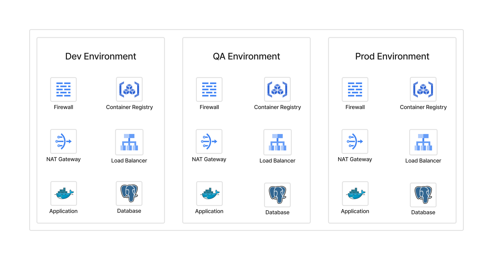
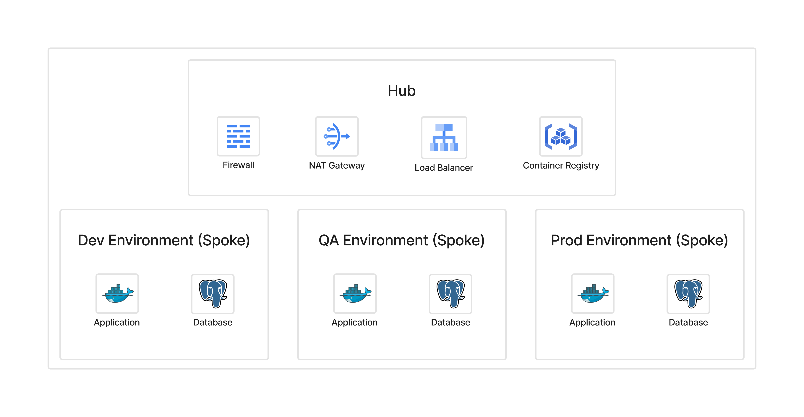
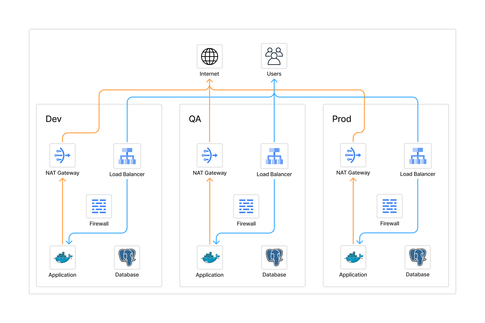
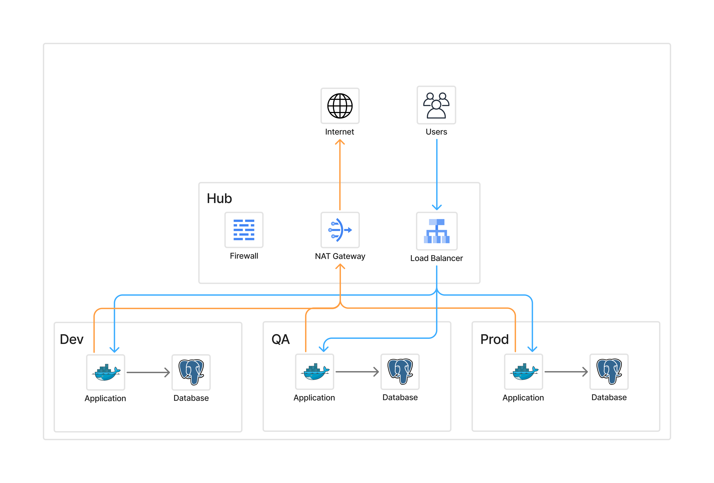
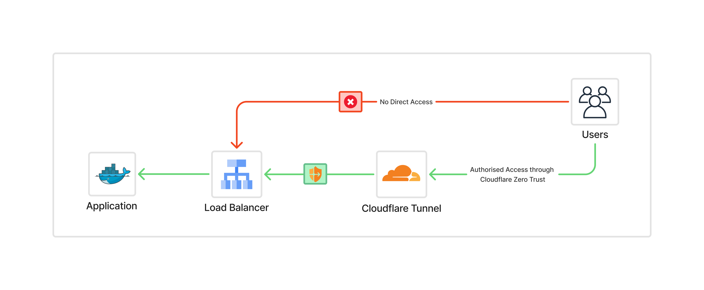
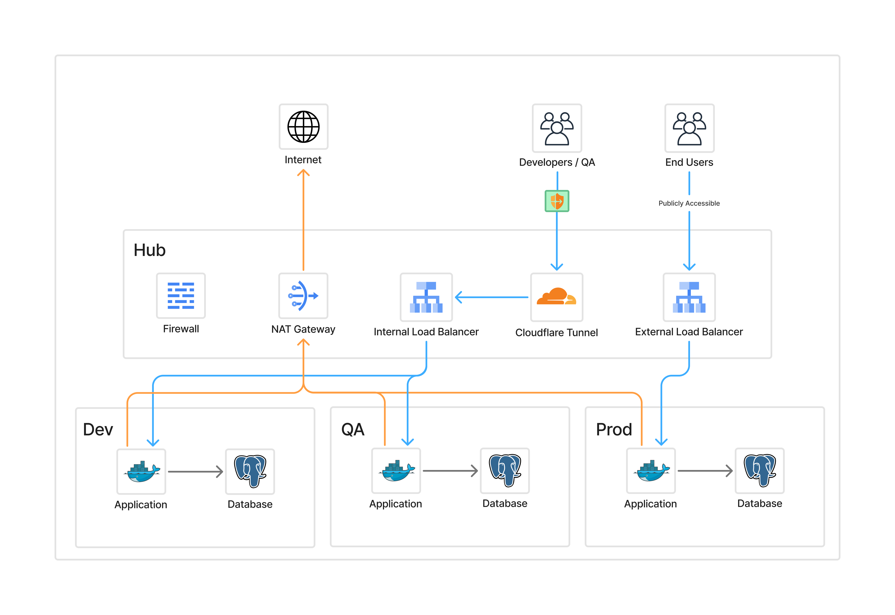
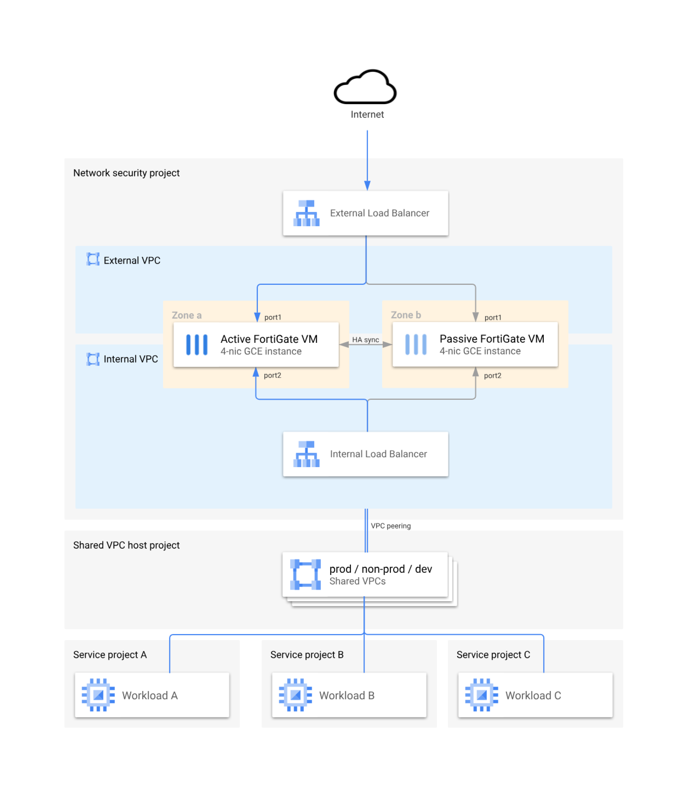
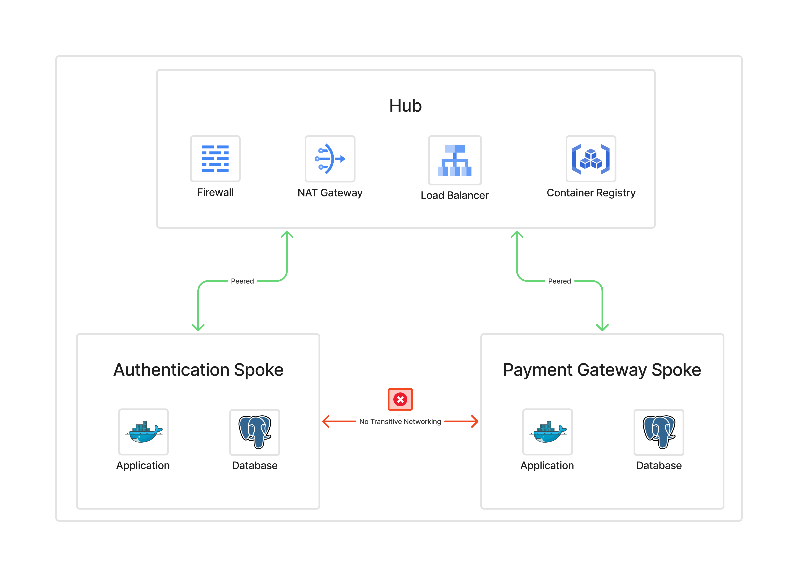
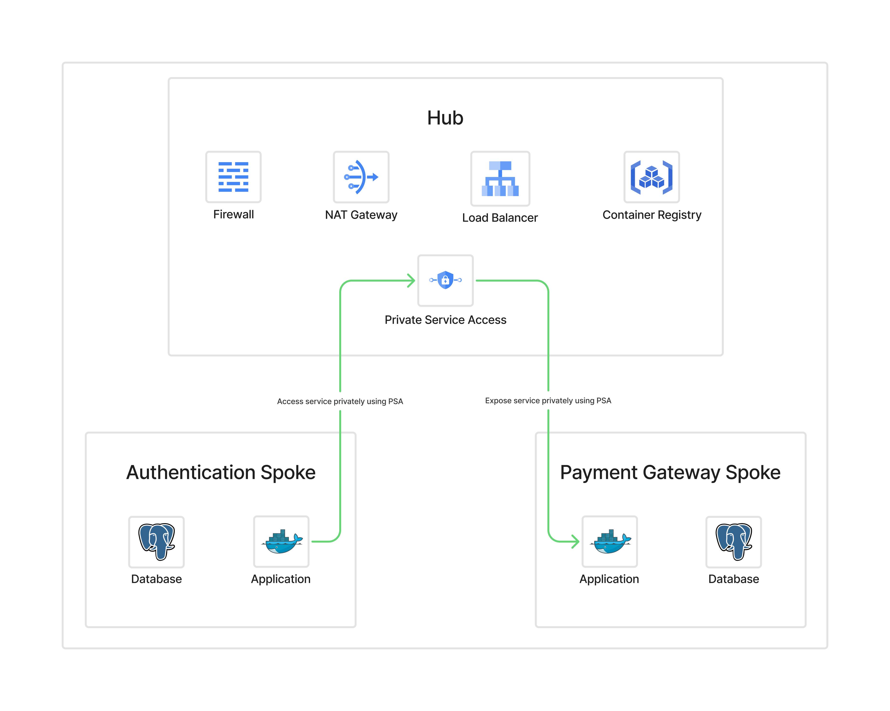

## Introduction

Most teams start with per-environment networks; Dev, QA, and Prod each with their own NAT, firewall, DNS, and load balancers. This approach is simple at first but quickly becomes costly, inconsistent, and difficult to secure.

In this post, I’ll walk through how we adopted a **hub-and-spoke network architecture secured with Cloudflare Zero Trust (ZTN)**. I’ll cover why we chose this model, how traffic flows, the security benefits, and real-world deployments, including industry practices from **Google Cloud and Surge Global**.

---

## The Problem: Per-Environment Networking

Each environment duplicating infrastructure looks like this:

* NAT, firewall, load balancer, DNS repeated in every environment
* Multiple ingress/egress points to manage
* Firewall policies scattered and inconsistent
* Logs and monitoring fragmented
* Higher costs and configuration drift risks


_Figure 1: Traditional per-environment networking - duplicated resources across Dev, QA, and Prod._

What seems easy for a small setup becomes a bottleneck at scale.

---

## The Solution: Hub-and-Spoke Architecture

In a hub-and-spoke model:

* **Hub** contains shared services (NAT, firewall, DNS, load balancer).
* **Spokes** are isolated environments (Dev, QA, Prod) that remain private.
* All ingress and egress flows through the hub.

**Benefits:**

* Centralised firewall and NAT management
* Uniform policies
* Reduced cost (one NAT, one firewall instead of many)
* Easier audits and observability


_Figure 2: Hub centralises shared networking and security, while spokes remain private and isolated._

---

## Traffic Flows

**Per-Environment (Monolithic) Model**

* Public traffic hits environment-specific load balancers.
* Applications egress through separate NATs.
* Each environment manages its own firewall rules.


_Figure 3: Per-environment traffic flow - multiple load balancers and NAT gateways per environment._

**Hub-and-Spoke Model**

* Public traffic flows → hub load balancer → spokes.
* Outbound traffic flows → spokes → hub NAT → internet.
* Developers and admins authenticate via Zero Trust before reaching any spoke.


_Figure 4: Hub-and-spoke traffic flow - single entry and exit point through the hub._

---

## Introducing Cloudflare Zero Trust

Zero Trust changes the game:

* Removes the need for public IPs
* Provides identity- and context-aware access
* Replaces VPNs with granular, policy-driven access


_Figure 5: Cloudflare Zero Trust acts as the identity-aware access layer, replacing public IPs and VPNs._

With Cloudflare ZTN, neither the hub nor the spokes need public exposure. Access flows through Cloudflare’s global edge, authenticated per user/device/policy.

---

## Deploying the Cloudflare Connector

Getting started is simple. Run the cloudflared daemon on a hub VM:

```bash
sudo cloudflared service install <token> 
```

Then apply a tight firewall rule to allow `cloudflared` to connect only to Cloudflare endpoints (TCP/UDP 7844).

From there, internal spokes no longer need public IPs; developer and admin access goes through Cloudflare, while production traffic can keep using the external load balancer.

```hcl
{
  name        = "allow-cloudflared-to-endpoints"
  description = "Allow cloudflared egress to the cloudflare endpoints"
  action      = "allow"
  direction   = "EGRESS"
  priority    = 501
  dest_fqdns = [
    "region1.v2.argotunnel.com",
    "region2.v2.argotunnel.com",
    "cftunnel.com",
    "h2.cftunnel.com",
    "quic.cftunnel.com"
  ]
  layer4_configs = [
    {
      ip_protocol = "tcp"
      ports       = ["7844"]
    },
    {
      ip_protocol = "udp"
      ports       = ["7844"]
    }
  ]
}
```

See the [Cloudflare Docs – Tunnel with Firewall](https://developers.cloudflare.com/cloudflare-one/connections/connect-networks/configure-tunnels/tunnel-with-firewall/).

---

## Final Architecture

The final state looks like this:

* Hub centralises NAT, firewall, and load balancers
* Spokes are fully private
* Cloudflare Tunnel provides secure developer/admin access
* End users reach production apps only via the external load balancer


_Figure 6: Final architecture - unified hub handling all ingress and egress, secured with Cloudflare Zero Trust._

This pattern isolates environments, simplifies operations, and eliminates public exposure.

---

## Real-World Examples

### Surge Global


_Figure 7: Hub-and-spoke deployment from an enterprise project at Surge Global._

We deployed this model at an Enterprise project at Surge Global, our first company project to use hub-and-spoke. It centralised firewall/NAT/DNS, used Cloudflare ZTN for non-prod environments, and reduced both cost and operational overhead.

### Industry Reference


_Figure 8: GCP reference architecture - Fortinet firewalls securing the hub, similar to large-scale enterprise and government environments._

Google Cloud publishes a reference hub-and-spoke model with Fortinet appliances protecting the hub. This design mirrors what the **Surge Global Project** runs today, showing that hub-and-spoke + Zero Trust is now an **industry standard** for secure, large-scale environments.

See the [Google Cloud – Fortinet Reference Architecture](https://cloud.google.com/architecture/partners/fortigate-architecture-in-cloud#architecture).

---

## Tradeoffs

No design is free:

* Routing is more complex than per-environment
* Hub is a critical dependency → must be highly available
* Steeper learning curve for teams
* Centralisation means changes affect all environments

---

## Key Considerations

When deploying hub-and-spoke, plan for:

* **IP address space** (avoid overlaps)
* **Non-transitive peering** (spoke-to-spoke must go via hub, or use Shared VPC / PSC / NCC)
* **Scaling limits** (peering, firewall throughput, `cloudflared` sizing)
* **High availability** (multi-zone, multi-region hub design)


_Figure 9: Non-transitive connectivity before redesign - spokes cannot communicate directly._


_Figure 10: Non-transitive connectivity resolved via hub routing - spoke-to-spoke traffic flows through hub._

---

## Hands-On Resources

To make this concrete, I’ve published **Terraform examples** that show three ways to deploy Cloudflare Tunnels in hub-and-spoke:

* **Full IaC with Kubernetes** (complete automation)
* **Manual + Kubernetes** (use existing tunnel, deploy cloudflared only)
* **Manual VM on GCP** (run cloudflared on Compute Engine)

[Cloudflare Zero Trust Terraform templates (GitHub)](https://github.com/ushiradineth/blog-assets/tree/main/hub-and-spoke)

---

## Further Reading & Resources

* [How Cloudflare does outbound-only connections](https://developers.cloudflare.com/cloudflare-one/connections/connect-networks/)
* [Cloudflare firewall configuration for tunnels](https://developers.cloudflare.com/cloudflare-one/connections/connect-networks/configure-tunnels/tunnel-with-firewall/)
* [GCP Hub-and-Spoke Architecture (official reference)](https://cloud.google.com/architecture/deploy-hub-spoke-vpc-network-topology)
* [GCP Hub-and-Spoke in practice with Fortinet](https://cloud.google.com/architecture/partners/fortigate-architecture-in-cloud)
* [Azure Landing Zone – Hub-and-Spoke Architecture](https://learn.microsoft.com/en-us/azure/architecture/networking/architecture/hub-spoke)
* [Cloudflare Zero Trust Terraform templates (GitHub)](https://github.com/ushiradineth/blog-assets/tree/main/hub-and-spoke)
